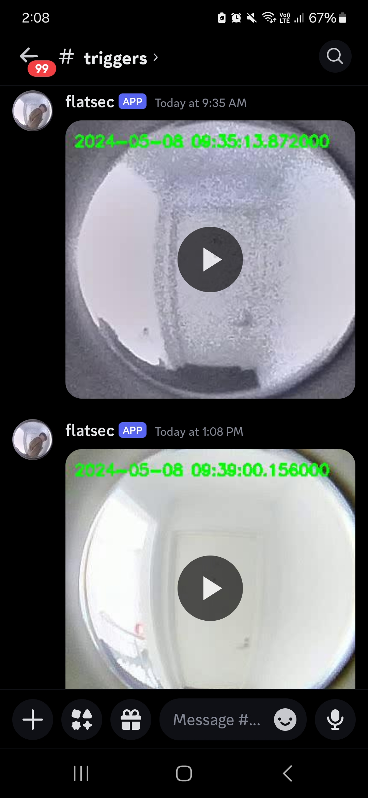

# Flat Security

The day prior to writing this little program, some posessions that my flatmate and I own magically gained the ability to move without their owner (us) touching them. We both love discovering new phenomena; this program might give us a helping hand!

<p align="center">
    
</p>

### Features:
 - Motion detection
 - Record some number of seconds before the first bit of motion was detected
 - Record some number of seconds after the last bit of motion was detected
 - Save this recording as an `mp4` with timestamps
 - Upload the recording to a Discord server
 - Recording only a certain area of the screen (i.e. crop the image)

### Parameters
```python
# VARS.py

# Top left and bottom right corners of the crop
CROP = ((800, 438), (1140, 764))
# Tune this parameter until you stop getting triggers when nothing is happening (lower = more sensitive)
START_THRESHOLD = 1.5
# Number of seconds to keep before the first bit of motion is detected
LEAD_RECORD_SECONDS = 3
# Number of seconds to keep after the last bit of motion is detected
AFTER_RECORD_SECONDS = 3

# Camera settings
CAM_HEIGHT = 1080
CAM_WIDTH = 1920
CAM_FPS = 30
# 1 = keep every frame, 2 = keep every other frame, 3 = keep every third frame, etc.
RECORD_EVERY = 1
# Of the frames that are being kept, average every n frames
AVERAGE_EVERY = 2
# Discord channel ID to send recordings to
DISCORD_RECORDING_CHAN = 1237290039516467255
```

### Running
We run it on a Raspberry Pi 5 with a systemd service. `tmux` is nice because it lets you tune parameters without restarting the service. Use `tmux a -t flatsec` to join the active terminal.

Make sure you substitue `<USER>` with your actual `whoami` and `<PATH TO FLATSEC>`.

```systemd
# /etc/systemd/system/flatsec.service
[Unit]
Description=Flat Security

[Service]
Type=forking
RemainAfterExit=yes
User=dude
ExecStart=/bin/bash /home/<USER>/startup/flatsec.sh
ExecStop=/usr/bin/tmux kill-session -t flatsec

[Install]
WantedBy=multi-user.target

```bash
#!/bin/bash
# /home/<USER>/startup/flatsec.sh

tmux new-session -s flatsec -d
tmux send-keys -t flatsec "cd <PATH TO FLATSEC>" C-m
tmux send-keys -t flatsec "sleep 3" C-m # possible that USB camera isn't initialized yet
tmux send-keys -t flatsec "python3 detection.py" C-m
```